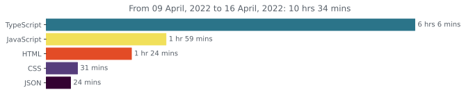

# Hey, I'm [Mola](https://www.howmanysyllables.com/syllables/mola) and I'm a Full-Stack Web Developer

#### I'm on

-  StackOverflow - [@a.mola](https://stackoverflow.com/users/15350139/a-mola)
-  Gmail - <a href="mailto:a.mola.dev@gmail.com">a.mola.dev@gmail.com</a>
-  Wakatime - [@iammola](https://wakatime.com/@iammola)

#### About Me
I'm 17 years old, and I'm a self-taught developer. I started learning Web Development in 2017 when I was in high school. I've been working with it professionally for 3+ years. I enjoy working the most with JavaScript, it’s the only programming language I know up to an advanced level, but I’m also practising Swift. I also plan on learning Golang, but I’m too busy for that now.

**My coding stats and contributions will be low while I try to improve my UI/UX skills.**

I'm available, and you can just send me an email if you want to contact me.

Have a good one 👍

  
  

## Resources

##### Languages

-  HTML
-  CSS
-  SCSS
-  TailwindCSS
-  PHP
-  JavaScript
-  TypeScript
-  React ( NextJS)
-  NodeJS

##### Databases

-  MongoDB
-  MySQL

##### IDEs

-  VS Code
-  Atom

##### Other

-  Wakatime
